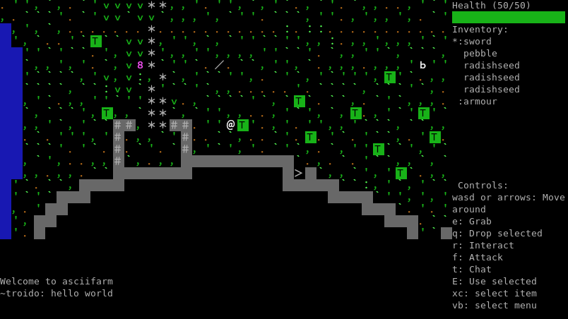

# Rustifarm
This is the rust version of the [asciifarm](https://github.com/jmdejong/asciifarm) server.

This server is intended to replace the python server soon as the main server.

To join the game you need the [asciifarm client](https://github.com/jmdejong/asciifarm-client).

## About Asciifarm

Asciifarm is a multiplayer RPG/farming game that is played in the terminal.

The intended use is to play this servers with a shared login (through ssh) but it can be layed in other contexts too.

Players can fight enemies and plant crops to gather resources.
